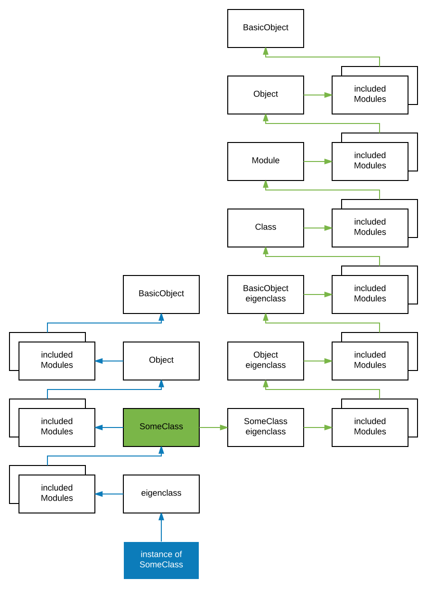

# Advanced Ruby
Meta-programming, DSLs, etc.

## Return values

In Ruby everything is an expression - it executes and returns some value, the result of it's execution. Let's take a
look at a simple example

[source]
----
5 + 2        # => 7
"hello"      # => "hello"
"a" if true  # => "a"
"a" if false # => nil

class A; end # => ???
----

What is the result of the last expression? It could be obvious - "we defined class A". But not really. The fact we have
defined a class is only an effect of the expression but not the result, result is a value returned from the expression
itself.

[source]
----
class A; end # => nil
----

The result is simply `nil`. It's similar to the expression `"a" if false` above. The condition is evaluated as false
and there is no `else` so there is nothing to return, so the result is `nil`. In this case a class was defined, but
there was nothing to be return, as the body of the class was empty, so the result is `nil`. Let's modify the example to
return a value

[source]
----
class A; 1; end            # => 1
class A; 1; "hello"; end   # => "hello"
class A; self; end         # => A
----

Before it was said that the return value of a method is the result of it's last expression. And it's obvious that in
this example it's very similar, and it can be generalized for all structures, even though sometimes it may not be
obvious on the first sight.

----
the return value is the the result of the last expression
----

## Context

In Ruby everything is executed in some context. This context is know as `current object` and is always represented
by self.

[source]
----
self.class # => Object

class B
  self
end
# => Class

class A
  def call
    self
  end
end

A.new.call # => #<A:some number>
----

## Class

### Open classes

Unlike most languages, Ruby classes are open for modifications. Developers can modify behavior of classes defined by
frameworks or Ruby itself. This technique is called `Monkey patching`.

[source]
----
class Clazz
  def call
    "A"
  end
end

class Clazz
  def call
    "B"
  end
end

Clazz.new.call # => "B"
----

### What is a class?

Let's start with a definition

----
classes are instances of class Class
----

and as mentioned many times before, everything in Ruby is an object ... even a class.

[source]
----
class A
  def self.call
    "A"
  end
end

B = Class.new

def B.call
  "called"
end

A.call      # => "called"
B.call      # => "called"

A.object_id # => [some number]
B.object_id # => [some number]

A.class     # => Class
B.class     # => Class
----

Class A was defined using the `class` keyword and then a class method was defined. Class B was created by creating new
instance of the `Class` class and the object was assigned to constant B. As both of those classes are objects, it's
possible to check it's class and the ID of the object.

### Inheritance

In Ruby classes can inherit from each other, though Ruby has only single-class inheritance - it's not possible to
inherit from multiple classes, only from one.

[source]
----
class A
 def call
   "called"
 end
end

class B < A
end

C = Class.new(B)

B.new.call # => "called"
C.new.call # => "called"
----

### Mixins

When some class needs to inherit from multiple classes, it's not possible, but Ruby provides a workaround through
mixins. It is possible to include many Modules into a class the methods defined in those modules will become part of
the lookup path as if they were defined in the class.

[source]
----
module Methods
  def call
    "called"
  end
end

class A
  include Methods
end

A.new.call # => "called"
----

### Class introspections

Ruby allows many introspections on classes and many other objects.

There is method `name` defined on a class that returns the name of the current class.

[source]
----
Array.name # => "Array"

[].class.name # => "Array"
----

It's possible to list methods of an object

[source]
----
class A
  def call
  end
end

A.new.methods # => array of methods
----

## Methods

As everything else in Ruby even methods are instances of class Method.

### Extracting methods

Sometimes it is useful to pass around only a method instead of the whole object. Ruby allows extraction of a method
for later usege.

[source]
----
class A
  def call(arg1)
    self
  end
end

meth = A.new.method(:call) # => #<Method: A#call>
----

In the example method `call` from class `A` was "extracted". The method is still bound to the instance of class A and
the method will be evaluated in the context of the object (`self` will be the instance). The method can be executed
by calling the `call` method with appropriate arguments.

[source]
----
meth.call("some string") # => #<A:some_number>
----

### Checking method existence

Because Ruby is a very dynamic language, it's not possible to know in advance what kind of arguments will be received.
In most cases the developer should not care what class the argument is, but whether the argument responds to a method.

----
Do not care what the object is, only care whether it behaves as expected.
----

This technique is called Duck typing.

[source]
----
class A
  def call
  end
end

a = A.new

a.respond_to?(:call) # => true
a.respond_to?(:wtf)  # => false
----

### Dynamic method calling

Let's define a class with a method, create an instance and call the method.

[source]
----
class A
  def call
  end
end

A.new.call
----

The method is called, but the develeoper had to know the name of the method beforehand ... in the time the code is
written. What if the method name is not known and there has to be some method called. Do not be surprised, this is
very common use-case in Ruby.

[source]
----
class A
  def call(arg1)
  end
end

a = A.new
a.call("some string")
a.send(:call, "some string")
----

Well, not so identical. When you use the send method on an object, you effectively bypass the access modifiers.

Ruby has three access levels `public` is default, `protected` and `private`.

[source]
----
class A

  def public_method
  end

  protected

  def protected_method
  end

  private

  def private_method
  end

end

a = A.new

a.public_method     # => nil
a.protected_method  # => NoMethodError: protected method `protected_method' called ...
a.private_method    # => NoMethodError: private method `private_method' called ...

a.send(:public_method)      # => nil
a.send(:protected_method)   # => nil
a.send(:private_method)     # => nil
----

### Defining methods programmatically

The way to define methods using the `def` keyword shown before is not the only one. It's also possible to define
method in a more dynamic way. It makes sense. We can inspect methods of an object, we can extract methods of an object
and also call methods of an object in a dynamic way. To dynamically define a method use the `define_method` method of
a class, however

----
Class.define_method is private
----

To get around this obstacle, it's possible to use the `send` method and bypass the access modifier.

[source]
----
class A
end

a = A.new

logic = Proc.new do
  "data"
end

A.send(:define_method, :some_method_name, logic)

a.some_method_name # => "data"
----

### Missing methods

Every object can define special `method_missing` method that is called whenever there is a call to undefined method
on that object.

[source]
----
class A
  def method_missing(name, *args, &block)
    puts "method #{name} called with args #{args.inspect}"
  end
end

A.new.something("a") # => method something called with args ["a"]
----

## Objects

Objects complement classes in a way that

----
objects define state and classes define behavior
----

Behavior id defined as a class, then an object is created for that class to hold the state. Every object has to be of
some class.

### Creating new object

To create an object of a class there is the `new` method on respective class.

[source]
----
class Dog
end

dog = Dog.new
----

### Defining methods

In the example above many methods were defined in simple or more fancy styles. But let's get back to the core and
try to define a method

[source]
----
class A
  def call
  end
end
----

here we use `def` keyword to define method `call`. Where will def define the method? The answer is simple and complex

----
def defines methods into the nearest class
----

So in the previous example the nearest class is A. That is obvious from next example where the current context is
returned and inspected

[source]
----
var = class A; self; end

var.class  # => Class
var.name   # => "A"
----

OK, so the the current context is a Class and thus is't obvious that the nearest class is this class. Now let's try to
define a class method

[source]
----
class A
  def self.call
    "string"
  end
end
----

Where will Ruby define the method now?? It is a bit more complicated. To understand this, we have to explain something
else first.

### Eigenclass

To understand how Ruby works, we have to understand what `eigenclasses` are. Let's start with simple definition

----
every object in Ruby has it's own eigenclass => an instance of Class
----

NOTE: eigen means "it's own" in German

Why is this important? Because, however the `eigenclasses` are basically invisible to developers, they take an important
part in method lookups.

When Ruby is trying to look up a method, it follows a basic chain (will be described a bit later). Important is, that
before the class the object is linked to, there is the one more class - object's eigenclass. Every single object in Ruby
has it's own `eigenclass` and because Classes are object as well, `eigenclasses` has their own `eigenclasses` as well.

----
The closest class to an object is not it's class but it's eigenclass.
----

Back to the example we were talking about

[source]
----
class A
  def self.call
    "string"
  end
end
----

to see it more clearly we can rewrite this example identically as

[source]
----
class A
end

def A.call
  "string"
end
----

these two expressions are identical. To understand why it is important to understand this

[source]
----
class A
end

scope = class A
  self
end

A == scope # => true
----

but back to the original question ... where is the method going to be defined? In the context of the instance of the
class A. The important part is the **instance of**. What is the closest class to an instance (object)? As stated above
it's its eigenclass. Now you might have guessed that from implementation point of view

----
there are no class methods in Ruby
----

What would be called a class method is only an instance method defined on the eigenclass associated with object
representing the class.

So eigenclass is some stealth object that we can not see? Not really. Ruby has ways to access eigenclasses

[source]
----
eigenclass = class << some_object
  self
end

eigenclass = some_object.singleton_class
----

now that we can access eigenclasses, let's see how we could define "class methods" (instance methods in the eigenclass).

[source]
----
class A
  def self.call
    "called"
  end
end

class B
  class << self
    def call
      "called"
    end
  end
end

D = Class.new
class << D
  def call
    "called"
  end
end
----

all those examples are identical.

### Method lookups

Now that you know where and how are methods defined, lets see how methods are looked up. Let's see how the class
hierarchy looks for class

----
SomeClass -> Class -> Module -> Object -> BasicObject
----

and for objects

----
object -> SomeClass -> Object -> BasicObject
----

though in real it is a bit more complex as seen in this picture

----
Eigenclasses are not visible as classes of objects.
----

[source]
----
o1 = Object.new

def o1.meth
  "string"
end

o1.meth  # => "string"
o1.class # => Object

o2 = Object.new

o2.meth  # => undefined method `meth`
o2.class # => Object
----

This example shows that having two instances of same objects. Both can behave differently. Because in the case of o1
the method is stored in the eigenclass, that is not accessible by o2.

----
Eigenclasses are used when a specific behavior of an object is expected.
----